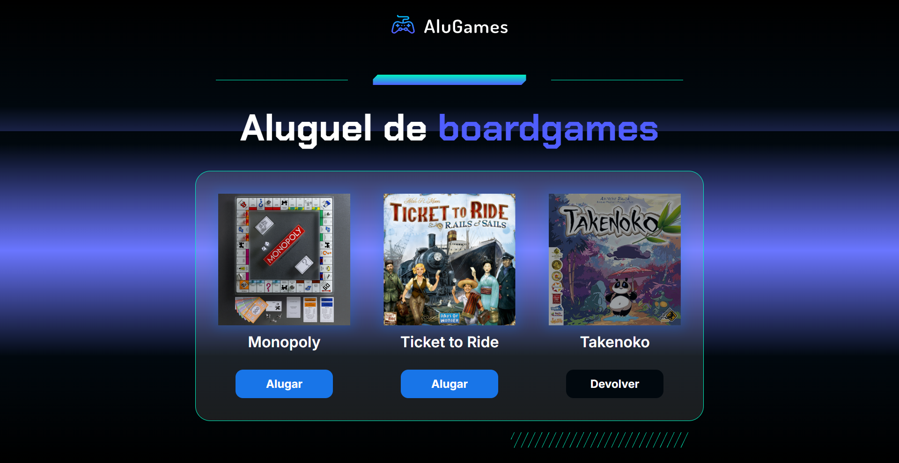

  

  

Este é o código-fonte do Projeto <b>Alugames</b>, desenvolvido durante o curso "Lógica com Programação com JavaScript" da Alura. 

## Tecnologias

- HTML
- CSS
- JavaScript

## Aprendizados

- Analisar o código de uma página HTML para entender sua estrutura e planejar o código de sua funcionalidade;
- Recuperar elementos da página com JavaScript, com o uso das funções document.querySelector() e document.getElementById();
- Declarar variáveis no JavaScript para armazenar elementos recuperados da página;
- Acessar a lista de classes que um elemento da página possui, via propriedade classList;
- Verificar se um elemento da página possui uma determinada classe CSS, via função classList.contains();
- Remover uma classe CSS de um elemento da página, via função classList.remove();
- Adicionar uma classe CSS a um elemento da página, via função classList.add();
- Alterar o texto de um elemento da página, via propriedade textContent;
- Declarar um bloco condicional if/else, para implementar a funcionalidade de alterar o status de um jogo.

## Acesse o projeto:

<a href="https://taoliveira.com.br/alugames-alura/" target="_balank"> Ver Projeto</a>

## Screenshots

