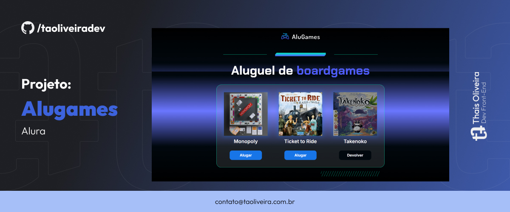

  

  

Este é o código-fonte do Projeto <b>Alugames</b>, desenvolvido durante o curso "Lógica com Programação com JavaScript" da Alura. 

## Tecnologias

- HTML
- CSS
- JavaScript

## Aprendizados

- No projeto Alugames, fizemos uma confirmação ao devolver um jogo, solicitando ao usuário que confirme a devolução antes que ela seja concluída. Isso pode ajudar a evitar devoluções acidentais.
- No projeto Alugames, criamos uma função para imprimir no console a informação sobre quantos jogos foram alugados.

## Acesse o projeto:

<a href="https://taoliveira.com.br/alugames-alura/" target="_balank"> Ver Projeto</a>

## Screenshots

